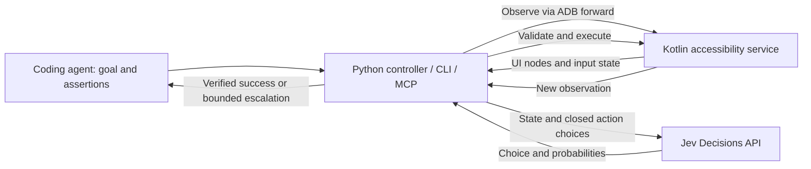

# Krilin

Krilin gives coding agents a bounded way to interact with Android emulators. An Android companion reads the accessibility tree, Jev chooses from actions grounded in that tree, and ordinary code executes and verifies the result.

This is a public project at version 0.2. It includes a working Python host, Kotlin Android companion, CLI, optional MCP server, an isolated demo screen, and a deterministic fixture app that exercises the UI patterns that make app testing hard. It is intended to grow across apps and agent clients. It is not yet a general Android test suite or a TalkBack gesture/speech validator.

The demo and the fixture scenarios have been exercised on an emulator with live Jev decisions. See [validation results and limits](docs/validation.md).



## Why Python and Kotlin

Python 3.11+ owns the task model, provider integration, execution policy, CLI, and MCP tools. Kotlin owns Android's accessibility nodes, events, and semantic actions. The main latency costs need to be measured in the device/API path; rewriting the controller in Rust would not remove those round trips. [Architecture and alternatives](docs/architecture.md) explain this split and its tradeoffs.

The Jev adapter uses OpenRouter's **`POST /api/alpha/decisions`** endpoint and pins **`typesafe/jev-1.13`**. The endpoint and request/response shapes were checked against the [official OpenRouter SDK](https://github.com/OpenRouterTeam/typescript-sdk/blob/main/docs/sdks/decisions/README.mdx) and [OpenAPI schema](https://openrouter.ai/openapi.json) on September 18, 2026. Alpha API changes may require adapter updates. An optional direct TypeSafe adapter uses its System One contract; it is separate from the OpenRouter path.

## Start without a device or key

Run these from the repository root:

```sh
python -m venv .venv
# Linux/macOS:
source .venv/bin/activate
# Windows PowerShell instead:
# .\.venv\Scripts\Activate.ps1

python -m pip install -e ".[mcp]"
python -m krilin demo
python -m unittest discover -s tests -v
```

`demo` uses deterministic fixtures, without a model, network, or emulator. It verifies the controller's mechanics; its timing is not a Jev benchmark. The MCP extra is optional: install `-e .` for the CLI and library alone.

## Connect an emulator

Install JDK 17 and Android SDK platform 35 plus platform-tools. Set `JAVA_HOME` to the JDK root (not its `bin` directory), and `ANDROID_HOME` to the SDK root. Android API 26 is the companion's minimum; current emulator images are preferred.

```sh
# Linux/macOS:
bash android/gradlew -p android :app:assembleDebug
# Windows PowerShell instead:
# .\android\gradlew.bat -p android :app:assembleDebug

adb devices
python -m krilin setup --serial emulator-5554
python -m krilin smoke
python -m krilin observe
```

`setup` installs the development companion, provisions a local bridge token, adds Krilin to the enabled accessibility services while preserving existing services, and allocates an ADB forward. It writes credentials to ignored `.local/bridge.json`. It does not need a model key. `smoke` opens only the companion's demo screen and runs a deterministic enter-name/save scenario.

Use `--bridge-config .local/another-device.json` before the command to manage another emulator. Each configuration has its own forwarded port. Use one configuration per device and share that path between agent clients so the device lock coordinates them. Re-run setup if the emulator or ADB server restart invalidates the forward. [Android setup details](android/README.md).

## Run with Jev

Copy `.env.example` to `.env`, then add your key:

```dotenv
OPENROUTER_API_KEY=your-key-here
```

The CLI loads `.env` from the current directory; environment variables take precedence. Use `--env-file` when running elsewhere. Credentials stay on the host and are excluded from trace output and version control.

Open the companion's **Open test screen** button, or reset its demo activity:

```sh
adb -s emulator-5554 shell am start -W -f 0x10008000 -n dev.krilin.bridge/.DemoActivity
python -m krilin run --task examples/save-name.json --trace .local/run.jsonl
```

Each task supplies a short goal, allowed app packages, success assertions, and any text to enter. Use `observe --brief` to see the elements of your own application as one line each; that is what you write selectors from. Example:

```json
{
  "goal": "Enter Krilin in Name, then Save",
  "allowed_packages": ["dev.krilin.bridge"],
  "assertions": [{
    "package": "dev.krilin.bridge",
    "resource_id": "dev.krilin.bridge:id/demo_status",
    "text": "Saved: Krilin"
  }],
  "text_values": {"dev.krilin.bridge:id/demo_name": "Krilin"}
}
```

### Selectors

Assertions and input targets are selectors. A selector combines any of `resource_id`, `text` (exact), `text_contains`, `description` (exact), `description_contains`, `role` (`Button`, `EditText`, ...) and `checked`; the `*_contains` fields ignore case and whitespace. Flutter, Compose and web apps expose few or no resource IDs, so their widgets are selected by description or text:

```json
{
  "goal": "Type the greeting into the Message field and press Send",
  "allowed_packages": ["com.example.chat"],
  "inputs": [{"target": {"role": "EditText", "description": "Message"}, "text": "Hello Natalia"}],
  "assertions": [
    {"package": "com.example.chat", "description_contains": "hello natalia"},
    {"package": "com.example.chat", "description": "Sending", "absent": true}
  ]
}
```

A positive assertion needs exactly one visible matching element; `"absent": true` needs none, which is how a test says "dialog dismissed", "row deleted" or "spinner gone". `text_values` remains the shorthand for fields that have resource IDs. Text is always supplied by the caller; Jev never generates it. The `noul` goal assessment is diagnostic: only explicit assertions can produce success. Password fields are excluded from actions and their values are redacted.

### Scenarios

A scenario is an ordered list of steps with an optional launch precondition that code executes before the first step. Steps run in order and stop at the first escalation; long goals that bundle several actions lower Jev's confidence, so prefer several short steps, each with its own assertions. See `examples/fixture/*.json`:

```json
{
  "name": "delete-with-confirm",
  "allowed_packages": ["dev.krilin.bridge"],
  "launch": {"package": "dev.krilin.bridge", "activity": ".FixtureActivity", "clear_task": true},
  "steps": [
    {"goal": "Dismiss the What's new dialog by pressing Got it, so the notes list becomes usable.",
     "assertions": [{"package": "dev.krilin.bridge", "text_contains": "got it", "absent": true}]},
    {"goal": "Open Note 04 from the list so its detail screen appears with the Delete note button.",
     "assertions": [{"package": "dev.krilin.bridge", "text": "Note 04", "role": "TextView"}]}
  ]
}
```

```sh
python -m krilin run --scenario examples/fixture/delete-with-confirm.json --trace .local/run.jsonl --record
```

The default budget is 20 steps and 60 seconds per task or step, and 300 seconds per scenario. `--max-steps` and `--max-seconds` can lower or raise those within hard limits. Low confidence, invalid model output, navigation cycles, provider failure, and budget exhaustion return an `escalated` result with the live state, recent history, and diagnostics: unmet assertions with the nearest elements, ambiguous inputs, and the candidate count. Waiting for a pending transition, a stale snapshot, or the late effect of an accepted action is handled by the controller and does not count as a loop. `--record` writes every observation into the trace so the run can be replayed offline (`krilin.replay`). CLI exit codes are `0` for success, `2` for escalation, and `1` for configuration/input errors.

## Connect a coding agent with MCP

Start the stdio server using an interpreter where the MCP extra is installed:

```sh
python -m krilin --bridge-config /absolute/path/to/.local/bridge.json serve --env-file /absolute/path/to/.env
```

Register that command and its arguments in your agent's MCP settings. Set absolute paths when the agent may run in another working directory. Do not place API keys directly in client configuration; use `--env-file` or inherited environment variables.

The server exposes:

- `android_observe()` — current UI elements, package, services, touch exploration, and IME visibility; no model call.
- `android_run(goal, allowed_packages, assertions, text_values, inputs, ...)` — one bounded subgoal with a verified result or escalation.
- `android_run_scenario(scenario)` — a launch precondition plus ordered steps, with per-step results.

An agent should break a longer test into explicit steps and assertions. MCP owns transport only; CLI and MCP call the same controller. The adapter uses the maintained MCP Python SDK 1.x line, constrained to `<2`; migrating to SDK 2 is isolated to this adapter.

## TalkBack and input state

Each observation includes enabled accessibility services, touch exploration, IME visibility, and `execution_mode: "semantic"`. The driver calls node actions such as `ACTION_CLICK` and `ACTION_SET_TEXT`, so it does not need to remember whether a physical tap now selects instead of activates. Krilin does not request touch exploration, intercept gestures, or disable TalkBack.

**Semantic success does not prove TalkBack gesture navigation or spoken output.** A dedicated gesture/speech testing driver is future work. TalkBack mode changes are observed state, not a prompt convention. The choice of a companion service avoids `UiAutomation`'s default suppression of other accessibility services. See the [Android API reference](https://developer.android.com/reference/android/app/UiAutomation).

## Scope and development

The actions are click, replace text, scroll forward/backward, optional global Back, wait, and escalation. Screenshots, OCR, coordinate gestures, automatic text generation, app launch planning by the model, and persistent resumable workflows are not implemented. Apps with incomplete accessibility trees may need a future driver adapter.

The companion's fixture screen (`.FixtureActivity`) is an offline, deterministic notes app with the patterns that make testing hard: a modal that must be dismissed first, delayed content, a form with validation, a filter toggle, a long list with off-screen rows, and an ID-less detail screen. `examples/fixture/` holds one scenario per pattern and `python scripts/evaluate.py --live --runs 3` measures them with Jev on a configured emulator, writing `.local/eval.json`; `--record` keeps replayable traces.

UI text from allowed packages is sent to the selected model provider. Local observations and optional JSONL traces may contain app data; use test accounts and review traces before sharing. The companion is a development tool for trusted emulators/hosts, not a remotely exposed Android service. [Protocol and trust boundaries](docs/protocol.md).

Contributions should keep Android-specific operations in the companion/driver layer and reuse the host's task contract. See [CONTRIBUTING.md](CONTRIBUTING.md) for validation and compatibility expectations.

Licensed under [MIT](LICENSE).
